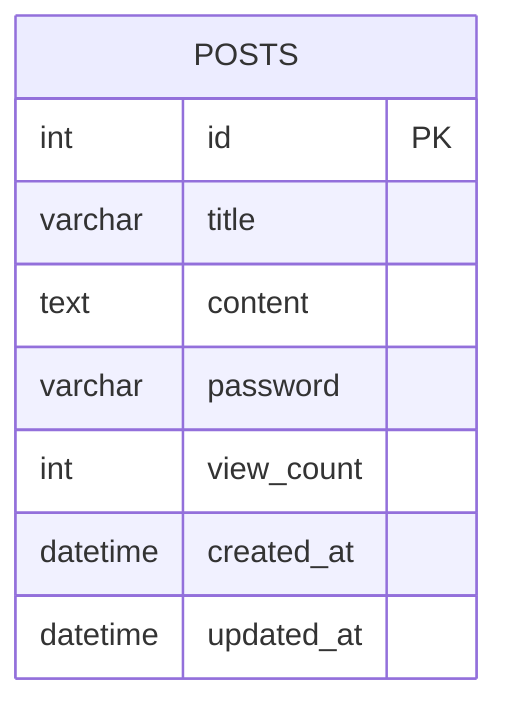

# 8_DB_설계서

이 문서는 LocalHub 백엔드에서 SQLite에 저장할 커뮤니티 게시글 구조를 정의한 설계서다. 지역정보는 data 폴더의 JSON 파일을 사용하므로 `locations` 테이블은 새로 만들지 않는다.

---

## 1. DB 사용 목적

SQLite 데이터베이스는 다음 목적을 위해 사용한다.

- 익명 커뮤니티 게시글의 CRUD 저장
- 서버 재시작 후에도 게시글 유지
- FastAPI와 SQLAlchemy를 통한 간단한 ORM 기반 접근
- 제출용 `.db` 파일 생성 및 검증 가능성 확보

---

## 2. SQLite 선택 이유

SQLite를 선택하는 이유는 다음과 같다.

- 과제 요구사항에 명시된 DB로서 `SQLite` 사용이 필수다.
- 별도 DB 서버 없이 로컬 실행과 Render 배포 환경에서 비교적 쉽게 사용 가능하다.
- 파일 기반 DB라서 제출 산출물인 `.db` 파일 관리가 쉽다.
- FastAPI + SQLAlchemy 조합에서 구현 난이도가 낮다.

---

## 3. posts 테이블 정의

게시글 데이터는 `posts` 테이블에 저장한다.

### 테이블명
- `posts`

### 주요 역할
- 게시글 생성
- 게시글 목록/상세 조회
- 게시글 수정
- 게시글 삭제
- 조회수 증가

---

## 4. 각 컬럼의 자료형

| 컬럼명 | 자료형 | 설명 |
|---|---|---|
| id | INTEGER | 게시글 기본 식별자 |
| title | VARCHAR | 게시글 제목 |
| content | TEXT | 게시글 본문 |
| password | VARCHAR | 수정/삭제용 평문 비밀번호 |
| view_count | INTEGER | 조회수 |
| created_at | DATETIME | 생성 시각 |
| updated_at | DATETIME | 수정 시각 |

---

## 5. Primary Key

- `id` 컬럼을 Primary Key로 사용한다.
- `id`는 자동 증가하는 정수값을 사용한다.

---

## 6. nullable 여부

| 컬럼명 | nullable |
|---|---|
| id | NO |
| title | NO |
| content | NO |
| password | NO |
| view_count | NO |
| created_at | NO |
| updated_at | NO |

---

## 7. 기본값

| 컬럼명 | 기본값 |
|---|---|
| id | AUTOINCREMENT |
| title | 없음 (필수 입력) |
| content | 없음 (필수 입력) |
| password | 없음 (필수 입력) |
| view_count | 0 |
| created_at | 현재 시각 |
| updated_at | 현재 시각 |

---

## 8. 길이 제한

| 컬럼명 | 길이 제한 | 비고 |
|---|---:|---|
| title | 200자 이내 | 과제 기준으로 명시된 제한은 없으므로 팀 기준 권장 |
| content | TEXT | 길이 제한 없음 |
| password | 100자 이내 | 평문 저장 기준으로 간단히 관리 |

> 가정: 제목은 짧은 텍스트로 제한하고, 본문은 자유롭게 입력 가능하게 한다.

---

## 9. 인덱스 여부

| 컬럼명 | 인덱스 여부 | 이유 |
|---|---|---|
| id | 예 | PK 기반 조회 최적화 |
| created_at | 예 | 최신 게시글 목록 조회 성능 개선 |
| title | 아니오 | 초기 MVP 범위에서는 필요 없음 |
| password | 아니오 | 보안상 인덱스 사용 지양 |

---

## 10. 생성일과 수정일 처리 방식

- `created_at`은 게시글 생성 시점의 시각을 저장한다.
- `updated_at`은 게시글 수정 시점의 시각을 갱신한다.
- 생성 시에는 두 값이 동일하게 설정한다.
- 수정 시에는 `updated_at`만 갱신한다.
- 저장 형식은 ISO 8601 문자열 또는 SQLite 기본 datetime 문자열을 사용한다.

> 가정: 프론트엔드와 백엔드가 날짜 형식에 대해 같은 포맷을 사용하도록 사전에 합의한다.

---

## 11. 조회수 증가 방식

- 게시글 상세 조회 시마다 `view_count`를 1 증가시킨다.
- 조회수 증가 로직은 상세 조회 API에서 실행한다.
- 조회수 증가가 실패해도 상세 조회 응답은 유지한다.

> 가정: 조회수는 단순 카운트이며, 중복 조회를 별도로 막지 않는다.

---

## 12. 비밀번호 저장 및 비교 방식

- 비밀번호는 평문으로 저장한다.
- 수정/삭제 요청 시 입력된 비밀번호와 저장된 비밀번호를 문자열 비교한다.
- 비밀번호는 응답에 포함하지 않는다.
- 비밀번호는 로그, 검색 결과, 챗봇 컨텍스트에도 포함하지 않는다.

> 중요: 평문 비밀번호 저장은 과제 요구사항에 따른 교육용 예외다. 실제 서비스나 실사용 환경에서는 절대 이렇게 구현하지 않는다.

> 중요: 실제 개인정보와 실제 사용 비밀번호를 입력하면 안 된다. 테스트용 더미 데이터만 사용한다.

---

## 13. API 응답에서 비밀번호 제외 방식

- `password` 컬럼은 ORM 모델 내부에는 유지하되, Pydantic 응답 모델에서는 제외한다.
- 응답용 스키마에서 `password`를 `exclude=True` 또는 `Field(exclude=True)` 방식으로 숨긴다.
- API 응답에는 `id`, `title`, `content`, `view_count`, `created_at`, `updated_at`만 포함한다.

---

## 14. SQLAlchemy Model 설계안

다음은 SQLAlchemy ORM 모델의 설계안이다.

```python
from sqlalchemy import Column, Integer, String, Text, DateTime, func
from sqlalchemy.orm import declarative_base

Base = declarative_base()

class Post(Base):
    __tablename__ = "posts"

    id = Column(Integer, primary_key=True, autoincrement=True)
    title = Column(String(200), nullable=False)
    content = Column(Text, nullable=False)
    password = Column(String(100), nullable=False)
    view_count = Column(Integer, nullable=False, default=0)
    created_at = Column(DateTime, nullable=False, server_default=func.now())
    updated_at = Column(DateTime, nullable=False, server_default=func.now())
```

### 설계 포인트
- `title`, `content`, `password`는 필수값으로 둔다.
- `view_count`는 기본값 0으로 초기화한다.
- 생성/수정 시각은 서버 시간 기준으로 저장한다.

---

## 15. Pydantic Schema와 ORM Model의 역할 차이

| 구분 | 역할 |
|---|---|
| SQLAlchemy ORM Model | DB 저장 구조와 테이블 매핑 담당 |
| Pydantic Schema | API 요청/응답 검증 담당 |

### 요청용 Schema
- `title`, `content`, `password` 입력값 검증
- 수정 요청 시 필수값 여부 확인
- 비밀번호는 요청에는 포함되지만 응답에서는 제외

### 응답용 Schema
- `password`를 제외한 응답 형식 정의
- `created_at`, `updated_at` 형식 통일
- 프론트엔드가 사용하기 쉬운 구조로 제공

---

## 16. DB Session 관리 방식

- 각 요청마다 `SessionLocal`을 생성하고, 작업 완료 후 닫는다.
- FastAPI 의존성 함수로 Session을 주입하는 방식을 권장한다.
- 트랜잭션 중 예외 발생 시 rollback 처리한다.
- DB 세션은 요청 단위로 관리한다.

### 권장 흐름
1. 요청 시작 시 세션 생성
2. CRUD 작업 수행
3. commit 또는 rollback 처리
4. 세션 종료

---

## 17. 테스트 DB 분리 방식

- 로컬 개발 시에는 기본 SQLite DB 파일을 사용한다.
- 테스트 시에는 별도 DB 파일을 분리하여 사용한다.
- 예시:
  - 개발 DB: `app.db`
  - 테스트 DB: `test.db`

### 목적
- 테스트 데이터가 개발 DB를 오염시키지 않도록 분리
- 테스트 재현성과 독립성 확보

---

## 18. 데이터 초기화 및 제출 시 주의사항

- 초기 개발 단계에서는 테스트용 게시글 데이터를 직접 넣지 않도록 한다.
- 실제 서비스와 유사한 비밀번호나 개인정보를 입력하지 않는다.
- 제출 시 SQLite DB 파일이 존재하는지 확인한다.
- `.db` 파일은 Git에 포함하지 않는 정책을 지키되, 제출 산출물로는 별도 제공한다.
- 데이터 초기화 시 기존 게시글이 사라질 수 있으므로 백업 또는 별도 파일 사용을 권장한다.

---

## ERD (Mermaid)



---

## 요약

- 게시글 저장은 `posts` 테이블 하나로 처리한다.
- 지역정보는 별도 테이블 없이 JSON 기반으로 제공한다.
- 비밀번호는 평문 저장이지만 응답에는 노출하지 않는다.
- 조회수는 상세 조회 시 증가한다.
- SQLAlchemy ORM과 Pydantic Schema를 분리해 사용한다.
