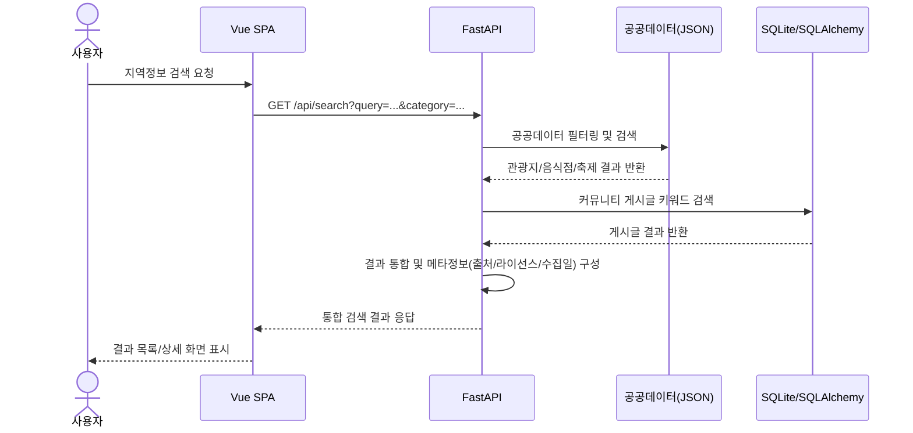
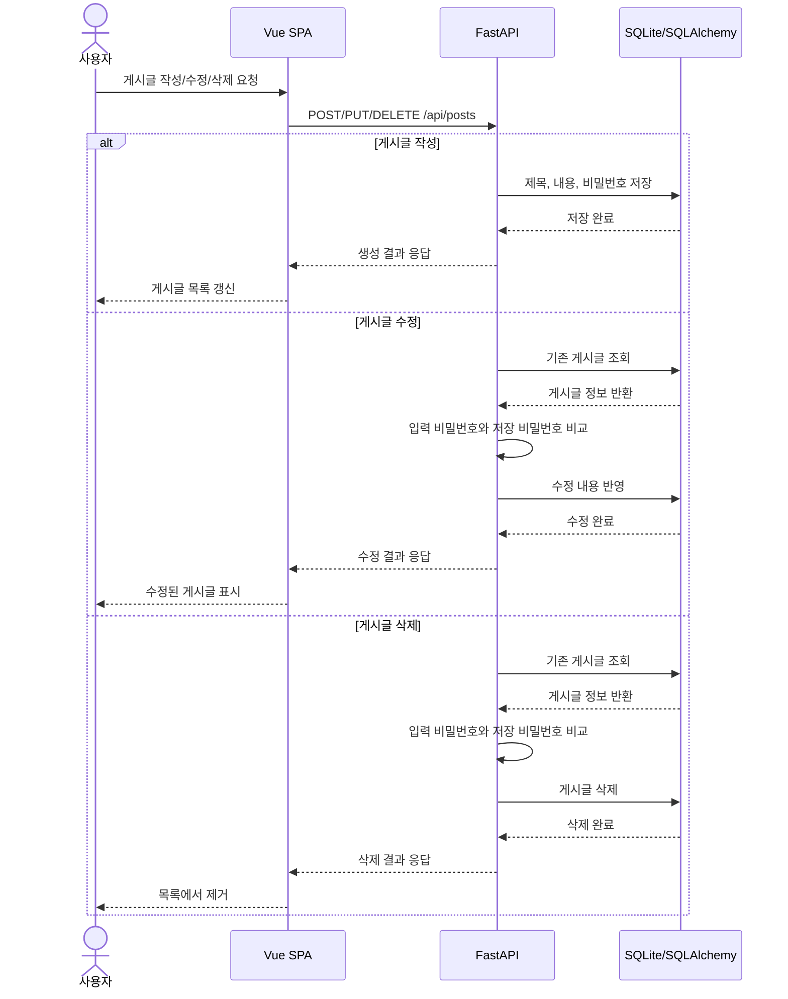
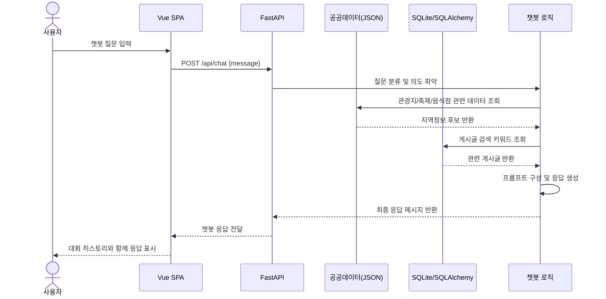

# LocalHub 시퀀스 다이어그램

## 1. 작성 배경
이 문서는 프로젝트 개요, 요구사항 분석, MVP 정의, WBS, 데이터 스키마를 바탕으로 작성한 LocalHub의 주요 사용자 시나리오 시퀀스 다이어그램입니다.

- 프로젝트 방향성: 익명 커뮤니티 + 공공데이터 기반 지역 정보 탐색 + 챗봇 질의 응답
- 핵심 기술: Vue 3 SPA, FastAPI, SQLite + SQLAlchemy
- 주요 데이터 소스: 제공된 구미/경북권 JSON 파일과 커뮤니티 게시글 DB

---

## 2. 시스템 구성 요소
- 사용자(User)
- 프론트엔드(Vue SPA)
- 백엔드(FastAPI)
- 데이터베이스(SQLite / SQLAlchemy)
- 공공데이터(JSON 파일 로더)
- 챗봇 응답 로직

---

## 3. 시나리오 A: 지역 정보 탐색 및 통합 검색
이 흐름은 사용자가 홈 화면에서 지역 정보를 찾고, 공공데이터와 커뮤니티 게시글을 함께 검색하는 과정입니다.

### 설명
- 사용자는 검색어와 카테고리 필터를 입력합니다.
- 백엔드는 공공데이터 JSON과 게시글 DB를 동시에 조회해 하나의 결과 세트로 조합합니다.
- 공공데이터 결과에는 출처와 라이선스 정보를 함께 표시할 수 있습니다.

---

## 4. 시나리오 B: 익명 게시판 CRUD
이 흐름은 로그인 없이 익명 사용자가 게시글을 작성하고, 수정 및 삭제하는 과정입니다.

### 설명
- 회원가입 없이 익명 사용자가 게시글을 작성합니다.
- 수정/삭제는 평문으로 저장된 비밀번호를 비교해 권한을 판단합니다.
- 데이터는 SQLite에 영속 저장되어 새로고침 후에도 유지됩니다.

---

## 5. 시나리오 C: 챗봇 질의 응답
이 흐름은 사용자가 자연어로 지역 정보나 커뮤니티 게시글을 묻는 경우의 처리 과정입니다.

### 설명
- 사용자의 질문은 지역정보 질의, 축제 일정, 음식점 위치, 게시글 검색으로 분류됩니다.
- 챗봇은 공공데이터와 게시글 DB를 함께 참고해 자연어 응답을 생성합니다.
- 프론트엔드는 대화 히스토리를 유지하며 모바일에서도 사용 가능해야 합니다.

---

## 6. 시퀀스 다이어그램 요약
이 프로젝트의 핵심 흐름은 다음 3가지로 정리할 수 있습니다.

1. 사용자 → Vue SPA → FastAPI → 공공데이터/DB → 결과 응답
2. 사용자 → Vue SPA → FastAPI → SQLite/SQLAlchemy → CRUD 결과 응답
3. 사용자 → Vue SPA → FastAPI → 공공데이터/DB/챗봇 로직 → 응답 생성

이 구조는 LocalHub의 MVP 방향성과 잘 맞으며, 공공데이터 탐색, 익명 게시판, 챗봇 기능이 하나의 서비스 안에서 유기적으로 연결되도록 설계한 형태입니다.
